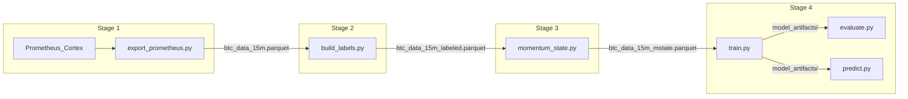

# How to Run the StagedBuild Pipeline

This document is the **end-to-end runbook** for the four-stage BTC regime
detection pipeline. Run the stages **in order** — each stage reads the parquet
produced by the previous one.

For what each stage *does* conceptually, see the per-stage docs:

| Stage | Doc |
|-------|-----|
| 1 — BTC Data Export | *(no WHAT_THIS_DOES yet — see script docstrings)* |
| 2 — Build Labels | [2_Build_Labels/WHAT_THIS_DOES.md](2_Build_Labels/WHAT_THIS_DOES.md) |
| 3 — Momentum State Encoder | [3_Momentum_State_Encoder/WHAT_THIS_DOES.md](3_Momentum_State_Encoder/WHAT_THIS_DOES.md) |
| 4 — Regime Classifier | [4_Classifier/WHAT_THIS_DOES.md](4_Classifier/WHAT_THIS_DOES.md) |

---

## Prerequisites

- **Python 3.10+** (3.11 or 3.12 recommended)
- **Network access** for Stage 1 only (Prometheus/Cortex endpoint)
- Stages 2–4 run fully offline once the parquet chain exists

### Install dependencies

Stage 1 has a `requirements.txt`. Stages 2–4 share the same core stack but
Stage 4 additionally needs LightGBM and scikit-learn.

```bash
# From the repo root:
cd StagedBuild/1_BTC_Data_Export
pip install -r requirements.txt

# Stages 2–4 (pandas/numpy are already installed above)
pip install lightgbm scikit-learn matplotlib

# Optional — only needed if you want PNG plots from Stage 3/4
pip install matplotlib
```

| Stage | Key packages |
|-------|-------------|
| 1 | `pandas`, `pyarrow`, `requests`, `tqdm` |
| 2 | `pandas`, `pyarrow`, `numpy` |
| 3 | `pandas`, `pyarrow`, `numpy`, `matplotlib` *(plots only)* |
| 4 | `pandas`, `pyarrow`, `numpy`, `lightgbm`, `scikit-learn`, `matplotlib` *(plots only)* |

---

## Data flow

Each stage writes one parquet file that the next stage reads:



| Stage | Script | Input | Output |
|-------|--------|-------|--------|
| 1 | `export_prometheus.py` | Prometheus API | `1_BTC_Data_Export/btc_data_15m.parquet` |
| 1 | `validate_export.py` | above parquet | stdout report |
| 2 | `build_labels.py` | Stage 1 parquet | `2_Build_Labels/btc_data_15m_labeled.parquet` |
| 3 | `momentum_state.py` | Stage 2 parquet | `3_Momentum_State_Encoder/btc_data_15m_mstate.parquet` |
| 4 | `train.py` | Stage 3 parquet | `4_Classifier/model_artifacts/` |
| 4 | `evaluate.py` | model artifacts | stdout + `4_Classifier/plots/` |
| 4 | `predict.py` | Stage 3 parquet + model | predictions parquet |

---

## Important gotchas (read before running)

### 1. Use 15-minute bars, not the script defaults

`export_prometheus.py` defaults to `--step 3600` (1-hour bars) and
`--output btc_data.parquet`. **The rest of the pipeline assumes 15-minute
bars** named `btc_data_15m.parquet`. Always pass `--step 900`.

### 2. Stage 2 output must land in `2_Build_Labels/`

`build_labels.py` writes its output next to the *input file* by default.
Stage 3 hardcodes its input path to:

```
2_Build_Labels/btc_data_15m_labeled.parquet
```

Run Stage 2 from inside `2_Build_Labels/` and pass `--output` explicitly
so the labeled parquet ends up where Stage 3 expects it.

### 3. Hardcoded absolute paths

Several scripts default to machine-specific absolute paths under
`/Users/mazenlawand/Documents/Calculin ML Models/StagedBuild/...`:

- `3_Momentum_State_Encoder/momentum_state.py` — default input
- `4_Classifier/data.py` — `DEFAULT_INPUT_PARQUET`

If you move the repo or run on another machine, pass explicit paths:

```bash
# Stage 3 — override input
python3 momentum_state.py /path/to/btc_data_15m_labeled.parquet

# Stage 4 — override data path
python3 train.py --data /path/to/btc_data_15m_mstate.parquet
```

### 4. Intermediate parquets are not committed

You must run Stages 1–3 to produce the parquet chain before Stage 4 can
train. The repo ships pre-trained `4_Classifier/model_artifacts/` so you
can run `evaluate.py` or `predict.py` without retraining — but a fresh
end-to-end run requires all four stages.

### 5. Unit tests referenced in stage docs are not in the repo

`2_Build_Labels/WHAT_THIS_DOES.md` and
`3_Momentum_State_Encoder/WHAT_THIS_DOES.md` mention `pytest test_*.py`
commands, but those test files are not present in this directory. Use
`verify_inflections.py` (Stage 3) and `validate_export.py` (Stage 1) for
sanity checks instead.

### 6. Stage 1 needs the Prometheus endpoint

Default URL: `http://10.1.20.60:9009/prometheus/api/v1/query_range`

Override with `--url` if your endpoint differs. The export can take several
minutes depending on the date range (default: ~13 months of data).

---

## Stage 1 — BTC Data Export

**Purpose:** Pull BTC price and three indicator time series from
Prometheus/Cortex into a wide-format parquet.

```bash
cd StagedBuild/1_BTC_Data_Export
pip install -r requirements.txt

python3 export_prometheus.py \
  --step 900 \
  --output btc_data_15m.parquet
```

### What it exports

| Column | Source |
|--------|--------|
| `price` | `crypto_last_price{symbol="BTCUSDT"}` |
| `weighted_norm_avg_16h_24h_48h` | weighted normalized avg indicator |
| `weighted_deriv_24h_48h_7d` | weighted derivative indicator |
| `norm_combined_avg` | normalized combined avg indicator |

### Optional flags

```bash
python3 export_prometheus.py \
  --start-date "2025-03-11 00:15:18" \
  --end-date   "2026-04-15 00:15:18" \
  --step 900 \
  --url http://10.1.20.60:9009/prometheus/api/v1/query_range \
  --output btc_data_15m.parquet
```

### Validate the export

```bash
python3 validate_export.py btc_data_15m.parquet --step 900
```

Look for `RESULT: PASS`. A `WARN` on NaN percentage for individual columns
is normal; gaps larger than 2× the step size are not.

**Expected output:** `1_BTC_Data_Export/btc_data_15m.parquet`

---

## Stage 2 — Build Labels

**Purpose:** Assign each bar one of four market regimes (CHOP, TRENDING_UP,
TRENDING_DOWN, VOLATILE_EXPANSION). These labels become the training target
for Stage 4.

```bash
cd ../2_Build_Labels

python3 build_labels.py \
  ../1_BTC_Data_Export/btc_data_15m.parquet \
  --output btc_data_15m_labeled.parquet
```

The script prints a regime distribution report. Rough sanity check:

- CHOP should be the largest share (~50–65%)
- TRENDING_UP and TRENDING_DOWN should be roughly balanced
- VOLATILE_EXPANSION is the rarest (~2–5%)

The first ~672 bars (7 days) are dropped as warmup for rolling features.

### Optional threshold tuning

```bash
python3 build_labels.py \
  ../1_BTC_Data_Export/btc_data_15m.parquet \
  --output btc_data_15m_labeled.parquet \
  --trend-return-threshold 0.008 \
  --volatile-return-threshold 0.01 \
  --min-hysteresis-bars 4
```

**Expected output:** `2_Build_Labels/btc_data_15m_labeled.parquet`

New columns added: `regime`, `regime_raw`, `regime_name`, `regime_start`,
`bars_in_regime`.

---

## Stage 3 — Momentum State Encoder

**Purpose:** Convert the three continuous indicators into ~140 causal
momentum-state features (derivatives, 9-class states, durations, warning
flags). This is the feature set Stage 4 trains on.

```bash
cd ../3_Momentum_State_Encoder

python3 momentum_state.py
```

With no arguments, this reads `../2_Build_Labels/btc_data_15m_labeled.parquet`
and writes `btc_data_15m_mstate.parquet` in the current directory.

The CLI prints three blocks — read them as a sanity check:

1. **Learned thresholds** — per-feature dead-zone cutoffs (should differ by scale)
2. **Learned epsilons** — "effectively flat" tolerance per (feature, window)
3. **State distribution** — share of bars in each of the 9 momentum states

### Optional: verify inflection events (recommended)

Confirms TROUGH/PEAK events fire at real turning points on the production data:

```bash
python3 verify_inflections.py
```

Mechanical check must be **100%**. Local extremum `*_strict` should be ≥ 99%.

Pick a different date window:

```bash
python3 verify_inflections.py --slice 2025-12-01 2025-12-15
```

### Optional: generate diagnostic plots

```bash
python3 visualize_states.py
```

Writes PNGs to `plots/` — state distribution bar chart, four-panel
diagnostics, and BTC-price-with-state-ribbon plots.

```bash
python3 visualize_states.py --slice 2025-12-01 2025-12-15
```

**Expected output:** `3_Momentum_State_Encoder/btc_data_15m_mstate.parquet`

---

## Stage 4 — Regime Classifier

**Purpose:** Train a LightGBM model that predicts the Stage 2 regime label
from Stage 3 momentum-state features only (no leakage columns).

```bash
cd ../4_Classifier
pip install lightgbm scikit-learn matplotlib

python3 train.py
```

Training takes ~10 seconds on a laptop. On completion, check `model_artifacts/`:

| File | Contents |
|------|----------|
| `model.txt` | Saved LightGBM booster |
| `feature_cols.json` | Ordered feature list the model expects |
| `class_weights.json` | Inverse-frequency weights used at training |
| `predictions_val.parquet` | Per-row val predictions |
| `predictions_test.parquet` | Per-row test predictions |
| `metrics.json` | Val/test accuracy and log-loss |
| `train_log.txt` | Captured training stdout |

### Evaluate

```bash
python3 evaluate.py --split test
python3 evaluate.py --split val
```

Prints confusion matrix, per-class report, confidence calibration, transition
accuracy, and feature importances. Writes plots to `plots/`.

Optional flags:

```bash
python3 evaluate.py --split test --transition-tolerance 4 --top-k-importances 25
```

There is also `evaluate_full.py` for a broader evaluation pass across all
splits if you need it.

### Score predictions (optional)

Apply the trained model to any parquet with the Stage 3 schema:

```bash
python3 predict.py \
  --input ../3_Momentum_State_Encoder/btc_data_15m_mstate.parquet \
  --output predictions.parquet
```

Output columns: `prob_CHOP`, `prob_TRENDING_UP`, `prob_TRENDING_DOWN`,
`prob_VOLATILE_EXPANSION`, `pred_int`, `pred_name`, `confidence`.

### Live inference (programmatic)

For a production loop, import the classifier class directly:

```python
from predict import RegimeClassifier
from momentum_state import MomentumStateEncoder

clf = RegimeClassifier()  # loads model_artifacts/ once

# Every 15 minutes:
# df = pull_latest_bars_from_prometheus(window="48h")
# df = MomentumStateEncoder(...).fit_transform(df)
# predictions = clf.predict(df.tail(1))
```

See [4_Classifier/WHAT_THIS_DOES.md](4_Classifier/WHAT_THIS_DOES.md) for the
full live-service pattern.

---

## Full pipeline — copy-paste block

Run everything from the repo root in one session:

```bash
# ── Stage 1: Export ──────────────────────────────────────────────
cd StagedBuild/1_BTC_Data_Export
pip install -r requirements.txt
python3 export_prometheus.py --step 900 --output btc_data_15m.parquet
python3 validate_export.py btc_data_15m.parquet --step 900

# ── Stage 2: Label ───────────────────────────────────────────────
cd ../2_Build_Labels
python3 build_labels.py \
  ../1_BTC_Data_Export/btc_data_15m.parquet \
  --output btc_data_15m_labeled.parquet

# ── Stage 3: Encode ──────────────────────────────────────────────
cd ../3_Momentum_State_Encoder
python3 momentum_state.py

# Optional sanity checks:
python3 verify_inflections.py
python3 visualize_states.py

# ── Stage 4: Train + Evaluate ────────────────────────────────────
cd ../4_Classifier
pip install lightgbm scikit-learn matplotlib
python3 train.py
python3 evaluate.py --split test
python3 evaluate.py --split val

# Optional — score the full dataset:
python3 predict.py \
  --input ../3_Momentum_State_Encoder/btc_data_15m_mstate.parquet \
  --output predictions.parquet
```

---

## Re-run and troubleshooting

### What to re-run when you change something upstream

| You changed… | Re-run from… |
|-------------|-------------|
| Prometheus date range or step | Stage 1 → 2 → 3 → 4 |
| Stage 2 regime thresholds / hysteresis | Stage 2 → 3 → 4 |
| Stage 3 features, windows, or encoder logic | Stage 3 → 4 |
| Stage 4 hyperparameters only | Stage 4 (`train.py`) |

Stage 3 must always be re-run before Stage 4 if Stage 2 output changed,
because the encoder's learned thresholds are fit on the first 70% of the
data chronologically.

### Common failures

**`FileNotFoundError` on Stage 3 or 4 input parquet**
→ Run the preceding stages first. Check that Stage 2 wrote to
`2_Build_Labels/btc_data_15m_labeled.parquet` (not inside
`1_BTC_Data_Export/`).

**Stage 1 returns no data / connection error**
→ Confirm network access to the Prometheus endpoint. Try `--url` with
your actual host. Check that the date range has data in Prometheus.

**Stage 1 validate shows timestamp gaps**
→ The export may have been interrupted. Re-run `export_prometheus.py`;
the script chunks requests and retries automatically.

**Stage 4 val log-loss suspiciously low (< 0.4)**
→ Likely a leakage column slipped through. Check that `LEAKY_COLUMNS` in
`4_Classifier/data.py` is intact and no regime-defining columns appear in
the feature importance list.

**Stage 4 `ModuleNotFoundError: lightgbm`**
→ `pip install lightgbm scikit-learn`

**Hardcoded path errors on a different machine**
→ Pass explicit paths:
```bash
python3 momentum_state.py /your/path/btc_data_15m_labeled.parquet
python3 train.py --data /your/path/btc_data_15m_mstate.parquet
```

### Skipping Stages 1–3 (evaluate existing model only)

If `4_Classifier/model_artifacts/` already exists and you only want to
inspect results:

```bash
cd StagedBuild/4_Classifier
python3 evaluate.py --split test
python3 evaluate.py --split val
```

You cannot run `train.py` without Stage 3's parquet unless you pass
`--data` pointing to an existing `btc_data_15m_mstate.parquet`.

---

## Quick reference — all scripts

| # | Directory | Script | Required? |
|---|-----------|--------|-----------|
| 1 | `1_BTC_Data_Export/` | `export_prometheus.py` | Yes |
| 1 | `1_BTC_Data_Export/` | `validate_export.py` | Recommended |
| 2 | `2_Build_Labels/` | `build_labels.py` | Yes |
| 3 | `3_Momentum_State_Encoder/` | `momentum_state.py` | Yes |
| 3 | `3_Momentum_State_Encoder/` | `verify_inflections.py` | Optional |
| 3 | `3_Momentum_State_Encoder/` | `visualize_states.py` | Optional |
| 4 | `4_Classifier/` | `train.py` | Yes |
| 4 | `4_Classifier/` | `evaluate.py` | Recommended |
| 4 | `4_Classifier/` | `evaluate_full.py` | Optional |
| 4 | `4_Classifier/` | `predict.py` | Optional |
| 5 | `5_Live_Service/` | See [5_Live_Service/HOW_TO_DEPLOY.md](5_Live_Service/HOW_TO_DEPLOY.md) | Production |
| 6 | `6_Bullish_Entry_State_Machine/` | See [6_Bullish_Entry_State_Machine/WHAT_THIS_DOES.md](6_Bullish_Entry_State_Machine/WHAT_THIS_DOES.md) | Optional (entry SM) |
