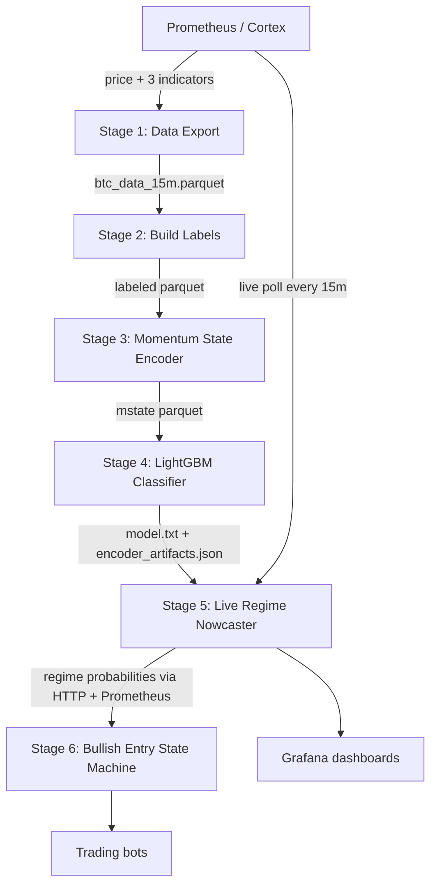

# BTC Market Regime Nowcaster

A machine-learning pipeline that answers one question in real time:

> **What kind of market are we in *right now*?**

It classifies the current BTC 15-minute bar into one of four market regimes —
`CHOP`, `TRENDING_UP`, `TRENDING_DOWN`, `VOLATILE_EXPANSION` — and publishes a
probability distribution plus a confidence score to Prometheus for dashboards
and downstream trading bots.

This is a **nowcaster**, not a price predictor. It does not forecast where price
is going; it characterizes the state of the market as of the latest closed bar
using only past data. The output is a *signal* (a feature), not a trade command.

---

## Table of contents

- [What it does](#what-it-does)
- [The four regimes](#the-four-regimes)
- [Pipeline architecture](#pipeline-architecture)
- [Features](#features)
- [The model](#the-model)
- [Current performance](#current-performance)
- [Live service & output](#live-service--output)
- [Prometheus / Grafana metrics](#prometheus--grafana-metrics)
- [Repository layout](#repository-layout)
- [Running the pipeline](#running-the-pipeline)
- [Design notes & known limitations](#design-notes--known-limitations)
- [Roadmap / next steps](#roadmap--next-steps)

---

## What it does

Every 15 minutes the live service:

1. **Fetches** the latest BTC price and three derived indicators from Prometheus.
2. **Encodes** them into causal momentum-state features (identical math to training).
3. **Classifies** the current bar with a trained LightGBM model.
4. **Publishes** the regime, confidence, and full probability vector as Prometheus
   metrics (scraped into Cortex for long-term storage and Grafana plotting).

Everything the model sees is **strictly backward-looking** — no future data — so
the offline-trained model behaves identically live.

---

## The four regimes

| Regime | Plain English | Typical bot behavior |
|--------|---------------|----------------------|
| **CHOP** (0) | Sideways, mean-reverting, no clear direction | Mean-reversion or sit out |
| **TRENDING_UP** (1) | Sustained upward momentum, contracting volatility | Trend-following longs |
| **TRENDING_DOWN** (2) | Sustained downward momentum, contracting volatility | Shorts / defensive exits |
| **VOLATILE_EXPANSION** (3) | Fast, large moves with a volatility spike | Reduce size, volatility tactics |

The integer codes (`0–3`) are what the Prometheus `..._regime_value` gauge emits.

---

## Pipeline architecture

The project is built in numbered stages. Each stage writes one artifact that the
next stage consumes. Stages 1–4 are **offline training**; Stage 5 is **live
inference**; Stage 6 is an **optional decision layer** on top.



| Stage | Role | Key output |
|-------|------|-----------|
| **1 — Data Export** | Pull BTC price + indicators from Prometheus | `btc_data_15m.parquet` |
| **2 — Build Labels** | Hindsight-label each bar with a regime (training target) | `..._labeled.parquet` |
| **3 — Momentum State Encoder** | Turn 3 indicators into causal momentum-state features | `..._mstate.parquet` |
| **4 — Classifier** | Train LightGBM to map features → regime probability | `model_artifacts/` |
| **5 — Live Service** | Run the model live, publish regime to Prometheus | HTTP API + metrics |
| **6 — Entry State Machine** | Convert regime probabilities into a gated bullish setup | `ENTER_LONG` signals |

See [`HOW_TO_RUN.md`](HOW_TO_RUN.md) for the full runbook and each stage's
`WHAT_THIS_DOES.md` for details.

---

## Features

### Base indicators (3)

All three are pulled live from Prometheus and are upstream transforms of BTC price:

| Indicator | Prometheus series |
|-----------|-------------------|
| `weighted_norm_avg_16h_24h_48h` | `job:crypto_last_price:weighted_normalized_avg:16h:24h:48h` |
| `weighted_deriv_24h_48h_7d` | `job:crypto_last_price:weighted_deriv:24h:48h:7d` |
| `norm_combined_avg` | `job:crypto_last_price:normalized_combined_avg` |

(`price` itself is fetched for logging/dashboards but is **not** fed to the model —
its scale drifts too much across time.)

### Momentum-state encoding (Stage 3)

Each base indicator is expanded across **4 lookback windows** — `16, 32, 96, 192`
bars (≈ 4h, 8h, 24h, 48h at 15m) — into 7 derived columns per (indicator, window):

| Column suffix | Meaning |
|---------------|---------|
| `_d1_<w>` | First derivative (windowed slope) |
| `_d2_<w>` | Second derivative (acceleration) |
| `_d1_fast_<w>` | Short-window first derivative — pins inflection events near the true turning point |
| `_mstate_<w>` | 9-class momentum state (see below) |
| `_mstate_duration_<w>` | Bars the current state has held |
| `_pre_cross_warning_<w>` | Rally is fading toward a downward zero-cross |
| `_pre_trough_warning_<w>` | Decline is running out of steam; trough imminent |

**The 9 momentum states** (causal, leading-signal biased):

```
8 DERIVATIVE_PEAK        f' flipped +→−  (sell event, top priority)
7 DERIVATIVE_TROUGH      f' flipped −→+  (buy event, top priority)
6 POSITIVE_ACCELERATING  f>thr, f'>0, f''>0
5 POSITIVE_DECELERATING  f>thr, f'>0, f''<0   (warning)
4 POSITIVE_FLATTENING    f>0,  |f'|<eps       (pre-cross)
3 CROSSING_DOWN          f flipped +→−        (lagging confirm)
2 NEGATIVE_DECELERATING  f<−thr, f'<0, f''>0  (pre-trough)
1 NEGATIVE_ACCELERATING  f<−thr, f'<0, f''<0
0 NEUTRAL                |f|<thr              (fallback)
```

Dead-zone thresholds and flatness epsilons are **learned on the first 70% of
history** (chronologically) and then **frozen** into
`5_Live_Service/artifacts/encoder_artifacts.json` so live inference exactly
matches training.

### Feature count

**3 base indicators + (3 × 4 windows × 7 derived) = 87 features** fed to the model.
The exact ordered list lives in `4_Classifier/model_artifacts/feature_cols.json`.

The five most important features by LightGBM gain are the raw
`weighted_deriv_24h_48h_7d`, its fast derivative, `weighted_norm_avg_16h_24h_48h`,
and the 24h/48h derivatives — i.e. the derivative-momentum signals dominate.

---

## The model

- **Algorithm:** LightGBM gradient-boosted trees, `objective=multiclass`, 4 classes.
- **Class imbalance:** inverse-frequency sample weights (VOLATILE_EXPANSION ≈ 2.4×)
  so the rare regime isn't ignored.
- **Split:** chronological 70 / 15 / 15 (train / val / test), **never shuffled**.
- **Early stopping** on validation multi-logloss.
- **Leakage guard:** the regime-defining columns (`rolling_return_*`,
  `realized_volatility_*`, and the label columns) are explicitly dropped in
  `4_Classifier/data.py`.

Key hyperparameters (defaults in `train.py`):

```
learning_rate      = 0.05     num_leaves       = 63
min_data_in_leaf   = 200      feature_fraction = 0.85
bagging_fraction   = 0.85     bagging_freq     = 5
lambda_l2          = 0.1      n_estimators     = 2000 (early-stopped)
```

---

## Current performance

From the most recent training run (`model_artifacts/metrics.json`, ~13 months of
15-minute bars, best iteration 49):

| Split | Accuracy | Macro F1 | Log-loss |
|-------|----------|----------|----------|
| Validation | 0.733 | 0.709 | 0.680 |
| Test | 0.694 | 0.638 | 0.731 |

High-confidence predictions (`confidence > 0.8`) are meaningfully more accurate
in backtests. Class balance drifts across the split (CHOP falls from ~39% in
train to ~27% in test), which is expected for crypto and is the main source of
the val→test gap.

> These numbers are measured against the hindsight label. See
> [Design notes](#design-notes--known-limitations) for why bar-accuracy is not
> the whole story for a nowcaster.

---

## Live service & output

Stage 5 runs the model in production. Each cycle emits JSON:

```json
{
  "timestamp": "2026-04-15T00:15:18+00:00",
  "price": 84250.0,
  "regime": "TRENDING_UP",
  "confidence": 0.83,
  "prob_chop": 0.05,
  "prob_trending_up": 0.83,
  "prob_trending_down": 0.08,
  "prob_volatile_expansion": 0.04,
  "bars_fetched": 768,
  "bars_usable": 385
}
```

HTTP endpoints:

| URL | Purpose |
|-----|---------|
| `GET :8080/health` | Liveness |
| `GET :8080/ready` | Readiness (true after first successful prediction) |
| `GET :8080/prediction` | Latest prediction JSON |
| `GET :9109/metrics` | Prometheus exporter |

History/config requirements: **15-minute bars**, minimum **384 bars (~4 days)**,
recommended **8 days** of lookback. See
[`5_Live_Service/HOW_TO_DEPLOY.md`](5_Live_Service/HOW_TO_DEPLOY.md).

---

## Prometheus / Grafana metrics

The live exporter (prefix `btc_regime_detector_*`) publishes these gauges/counters
— this is what your Grafana dashboard plots:

| Metric | Type | Meaning |
|--------|------|---------|
| `btc_regime_detector_regime_value` | gauge | Current regime as int (0–3) |
| `btc_regime_detector_confidence` | gauge | Max class probability (0–1) |
| `btc_regime_detector_prob{regime=...}` | gauge | Per-regime probability |
| `btc_regime_detector_last_price` | gauge | BTC price at last prediction |
| `btc_regime_detector_last_timestamp` | gauge | Bar timestamp used (unix) |
| `btc_regime_detector_last_run_unix` | gauge | When the loop last ran |
| `btc_regime_detector_last_run_success` | gauge | 1 = last cycle ok, 0 = failed |
| `btc_regime_detector_bars_fetched` | gauge | Bars pulled last cycle |
| `btc_regime_detector_bars_usable` | gauge | Bars with complete features |
| `btc_regime_detector_prediction_runs_total{status=...}` | counter | Success/failure count |

Stage 6 adds a separate `btc_entry_sm_*` metric family (state machine state,
breakout flags, `ENTER_LONG` counter).

---

## Repository layout

```
StagedBuild/
├── README.md                      ← you are here
├── HOW_TO_RUN.md                  ← end-to-end runbook
├── 1_BTC_Data_Export/             ← Prometheus → parquet
├── 2_Build_Labels/                ← hindsight regime labels (training target)
├── 3_Momentum_State_Encoder/      ← causal momentum-state features
├── 4_Classifier/                  ← LightGBM training + evaluation
│   └── model_artifacts/           ← model.txt, feature_cols.json, metrics.json
├── 5_Live_Service/                ← live nowcaster (HTTP API + Prometheus)
│   ├── artifacts/                 ← packaged model + frozen encoder thresholds
│   └── k8s/                       ← Kubernetes manifests
└── 6_Bullish_Entry_State_Machine/ ← optional decision/gating layer
```

Each stage has its own `WHAT_THIS_DOES.md`.

---

## Running the pipeline

Full instructions (dependencies, gotchas, per-stage commands) are in
[`HOW_TO_RUN.md`](HOW_TO_RUN.md). Quick version:

```bash
# Stage 1 — export
cd 1_BTC_Data_Export
pip install -r requirements.txt
python3 export_prometheus.py --step 900 --output btc_data_15m.parquet

# Stage 2 — label
cd ../2_Build_Labels
python3 build_labels.py ../1_BTC_Data_Export/btc_data_15m.parquet \
  --output btc_data_15m_labeled.parquet

# Stage 3 — encode
cd ../3_Momentum_State_Encoder
python3 momentum_state.py

# Stage 4 — train + evaluate
cd ../4_Classifier
pip install lightgbm scikit-learn matplotlib
python3 train.py
python3 evaluate.py --split test
```

---

## Design notes & known limitations

Being upfront about the design so anyone reading the repo understands the model's
scope:

- **Everything derives from price.** The three indicators and the training label
  are all transforms of the same BTC price series. The model cannot see
  information that isn't in price — its value is in producing a *smoother,
  slightly leading, probabilistic* read of the regime versus the raw thresholds.
- **The label is (near-)computable from price.** Stage 2's regime is a
  backward-looking function of rolling returns/volatility. The model's job is to
  reproduce that from causal indicator features and, ideally, flag transitions a
  little earlier — not to add an independent signal. Bar-level accuracy vs. a rule
  the label already encodes is therefore a floor metric, not the real KPI.
- **Hysteresis in labels is non-causal.** Stage 2 absorbs short regime runs by
  looking at how they end, so the *label* near transitions uses future bars. Fine
  for training targets; it means the exact label can't be reproduced live at time t.
- **Probabilities are weighted, not calibrated.** Inverse-frequency class weights
  distort the raw `prob_*` outputs. Anything thresholding on those probabilities
  (e.g. Stage 6) should account for this or use calibrated scores.
- **Single chronological split.** Robustness would benefit from walk-forward
  evaluation with a purge/embargo gap between folds.

---

## Roadmap / next steps

- [ ] **Model comparison** — benchmark this LightGBM nowcaster against:
  - a persistence baseline (repeat previous regime),
  - the raw rule computed live from price (the natural baseline for a nowcaster),
  - alternative models / feature sets.
  Report per-fold walk-forward metrics and **lead time at transitions** (how many
  bars before the label flips does the probability cross a threshold), not just
  bar accuracy.
- [ ] **Probability calibration** before probabilities feed the decision layer.
- [ ] **Bot integration** — define how a trading bot consumes the regime + confidence
  (allowed strategies / position sizing per regime), using Stage 6 as the gating
  layer rather than acting on `argmax` directly.
- [ ] **Live drift monitoring** — run the price-based rule alongside the model in
  Stage 5 and alert when their disagreement rate climbs (signal to retrain).
```
